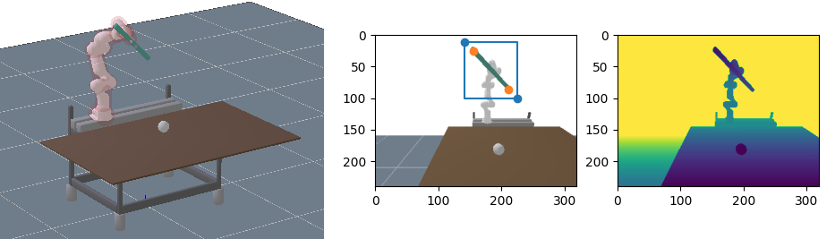

Learning and Intelligent Systems Project, TU Berlin, WS 20/21

# Keypoint Detection for Robotic Manipulation

Marius Montebaur, Danny Driess, Jung-Su Ha, Marc Toussaint

Media:
[Final Presentation](https://tubcloud.tu-berlin.de/s/Qp5FALCixYzfnXJ),
[Project Report](https://tubcloud.tu-berlin.de/s/qYYnQbwzm9GS9Qn),
[Project Video](https://youtu.be/elughHuADBA)





## Repository Structure

Every subdirectory has its own `README.md` file with detailed explanations.

- `data_generation/`: Scripts for generating training data and download links to datasets.
- `evaluation/`: Contains code that analyzes a trained network's performance in specific scenarios.
- `common/`: Code used for data generation as well as evaluation.
- `mankey/`: Developed from [mankey-ros repo](https://github.com/weigao95/mankey-ros). **Man**ipulation based on **Key**points.
  - `training/`: Training scripts for different versions of the keypoint detection.
  - `inference/`: Code to infer the 3D positions of keypoints from predictions.
  - `network/`: Network definitions
- `third_party/`
  - [`rai/`](https://github.com/MarcToussaint/rai): Simulator
  - [`mrcnn_integrate/`](https://github.com/montioo/mrcnn_integrate): A fork of the code that was used to train the bounding box (segmentation) algorithm and adapted it to work with the stick.
  - [`maskrcnn-benchmark/`](https://github.com/montioo/maskrcnn-benchmark): A fork of a segmentation algorithm by facebook research. It's not maintained anymore and my fork fixes a few things and adds a Dockerfile.


## Installation

Unless stated otherwise, the code in this repository was used and tested with Python 3.6 and PyTorch 1.7.1.

After cloning, first make sure all submodules are cloned as well:
```bash
git submodule init
git submodule update
```

### Install necessary Python Packages
```bash
# Used by data generation and evaluatoin
pip3 install pybind11 jupyter matplotlib
# Used to train the model. PyTorch is also needed, look below.
pip3 install Pillow pretrainedmodels attrs opencv-python
# Used to visualize and inspect the network's structure
pip3 install torchsummaryX torchviz
```

### Install PyTorch
Depending on your machine, choose to install pytorch with cuda support or without.
```bash
# With cuda support
pip3 install torch==1.7.1+cu102 torchvision==0.8.2+cu102 torchaudio==0.7.2 -f https://download.pytorch.org/whl/torch_stable.html
# Without cuda support
pip3 install torch==1.7.1+cpu torchvision==0.8.2+cpu torchaudio==0.7.2 -f https://download.pytorch.org/whl/torch_stable.html
```

### Building rai Simulator
```bash
cd third_party/rai

# Copy default config and disable dependency on pytorch
cp build/config.mk.default config.mk
echo "TORCH = 0" >> config.mk

# Print dependencies the install script will install
make -j1 printUbuntuAll
# Install necessary dependencies
make -j1 installUbuntuAll
# Build rai
make -j $(nproc)
```


## Running

Detailed running instructions for the data generation, the training process and the evaluation are found in their respective directories. Feel free to skip a step, e.g. by not generating training data on your own, but by using the data available for download.

To use the keypoint detection training and inference code, set the python path to include this repository's root:
```bash
# From this repo's root
source set_pythonpath.sh
```


## Model and Training Data Download

The models that have been used for the evaluation and the generated training data are available for download.
- Training data: Descriptions of the different datasets and links are available listed in [`data_generation/README.md`](data_generation/README.md).
- Trained Models: Training procedure and download links are in [`mankey/README.md`](mankey/README.md).

