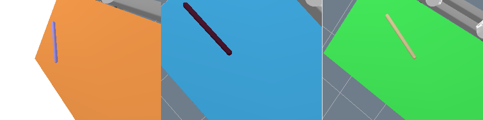
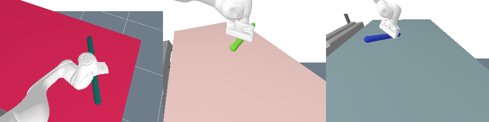
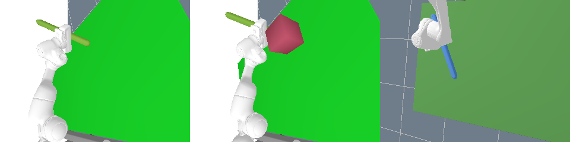

# Data Generation

The scripts in this folder are used to generate training data for the algorithm. The [rai simulator](https://github.com/MarcToussaint/rai) is used and the data is generated in the [format](https://github.com/RobotLocomotion/pytorch-dense-correspondence/blob/master/doc/data_organization.md) proposed for the [pytorch-dense-correspondence](https://github.com/RobotLocomotion/pytorch-dense-correspondence) project.


## Setup

To generate your own training data use one of the following scripts:
- `gen_data_cam.py`: Generates the data in *Dataset 1 - Simple*, see below.
- `gen_data_grasped.py`: Generates the data in *Dataset 2 - Gripper*, see below.
- `gen_data_timeseries.py`: Generates the data in *Dataset 3 - Sequence*, see below.

The `config.py` script can be used to change the output folder directories and the amount of data that is generated.


## Folder Structure

The training data structure has previously been used and described [here](https://github.com/RobotLocomotion/pytorch-dense-correspondence/blob/master/doc/data_organization.md).

```
pdc/logs_proto/

    2021-02-27-19-45-56/   <-- one collection
        processed/
            images/
            image_masks/
            stick_2_keypoint_image.yaml
            ds_desc.txt

    2021-02-27-20-01-22/
        ...
```

- `images/`: Contains RGB and depth images. The depth is given in mm and the images are stored as `.png` files.
- `image_masks/`: Masks for the stick, also stored as `.png` files.
- `stick_2_keypoint_image.yaml`: A file containing the ground truth information for each sample. It is a `.yaml` file, holding a dictionary at the top level with a continuous id for every sample. Ids have to be unique in each collection (each folder that is named with a date) but not over all of the different collections.
- `ds_desc.txt`: Optional file that is not used by any algorithm but just for humans to take notes on specific datasets. Will be automatically created from a string that is given to the training data generation scripts as an argument.


## Data Format

The file `stick_2_keypoint_image.yaml` holds the description for one image (actually image pair, made up of the rgb, depth and mask):

```yaml
0:
  3d_keypoint_camera_frame:
  - [-0.6805745444118833, -0.21452309699179856, 1.0592721775315597]
  - [-0.20850527175242684, -0.18565776189540958, 0.6708891791000244]
  bbox_bottom_right_xy: [117, 176]
  bbox_top_left_xy: [44, 145]
  camera_to_world:
    quaternion: {w: -0.9126935208776057, x: -0.08079065738250282, y: -0.33444569787104994,
      z: 0.22047558096825381}
    translation: {x: 0.7645597685155983, y: 0.18015152140403384, z: 1.4522977179435401}
  depth_image_filename: 000000_depth.png
  keypoint_pixel_xy_depth:
  - [52, 153, 1059]
  - [108, 166, 670]
  rgb_image_filename: 000000_rgb.png
  timestamp: '16144515573769572'
1:
  ...
```

Most of the entries should be self-explanatory and more information can be found in `common/data_extraction.py`, where the data for each key is generated. Depth is always given in mm and is the distance along the camera's viewing axis and *not* the euclidean distance between keypoint and camera.


## Download Datasets

You can also download the datasets that were created during development of this project.

All of these datasets feature a stick of varying length. The stick's and table's colors are chosen randomly.

- [Dataset 1 - Simple](https://mega.nz/file/47REBbBZ#nyPv2t-NV0b5wjyCjIbRvl4SZrjirLf5OSSqc_9wtOo): Stick is laying on different positions flat on the table while the camera is orbiting around it. 70000 samples, ~730 MB (deflated)

- [Dataset 2 - Gripper](https://mega.nz/file/kzIwhboR#jcX7MeqacY3yR9BxhLXRdTbqupAp51523iL1Bory1Uc): Stick is held by the robot's end effector. The arm is moved to different configurations and the camera is again taking pictures from different viewing angles. 30007 samples, ~670MB (deflated)

- [Dataset 3 - Time Series](https://mega.nz/file/8ioxgTgT#8apgWFvK6SRZ2u1sF9SW42VE27otMbZQGkcG23aOp5M): Setup as with Dataset 2, but this images are organized in sequences of five images. Five sequential images are related in a temporal context, i.e. show a continuous movement. The first image of each sequence has both keypoints visible, the other four images of each sequence may have one keypoint occluded by the robot itself or artificially inserted geometry. 82000 samples, ~2.2GB (deflated)



## Inspecting Datasets

- `count_data_samples.py`: Counts how many images have been generated in the folder specified in `config.py`.
- `fix_faulty_dataset.py`: Was used to filter some faulty datasets (they were missing images in sequences) for valid data. Since the script for generating time series data has been fixed, the script is not really needed anymore but might be a guide if you want to iterate over the generated dataset for some reason.
