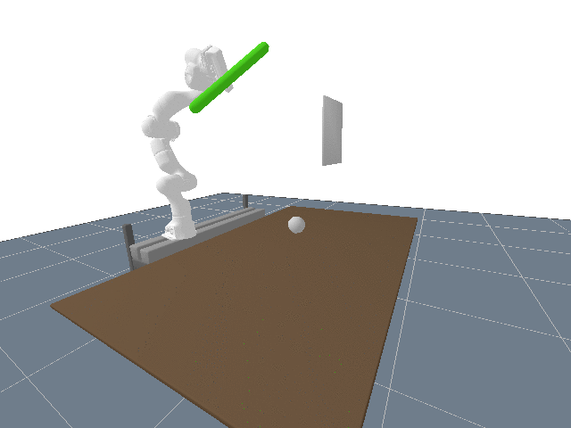
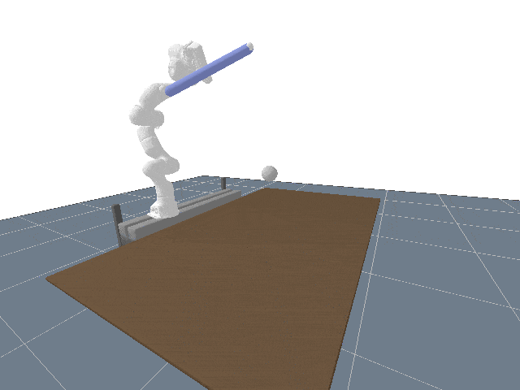

# Evaluation

This subdirectory holds scripts used to evaluate the model's performance. There are two scenarios which are described below.

## Evaluation Scenarios

### Trajectory Reconstruction

The robot moves a stick that is attached to its end effector and the trained model is tasked with reconstructing the trajectory of the stick's ends, i.e. keypoints. The ground truth of the keypoint position at each frame is shown with red dots, the prediction in green.

This gif shows the trajectory reconstruction using the LSTM enhanced keypoint detection network. The images on which the network performed inference were generated by a camera that was located on the right of the camera that recorded the images for the gif. This way, the right keypoint was occluded by the wall in roughly half of the frames.

The file `track_movement.py` contains the scenario and code to reconstruct the trajectory. Depending on which network is used in the `main()` function, the normal network or the LSTM enhanced version will be used.

### Stick Pointer

Another scenario is given in `stick_pointer.py`. The robot is tasked with always pointing one end of the stick to a previously defined position. As the robot completes this task, the length and orientation of the stick in the robot's gripper change. The inference is done again on the new model and the robot will again point the stick to the goal location.

